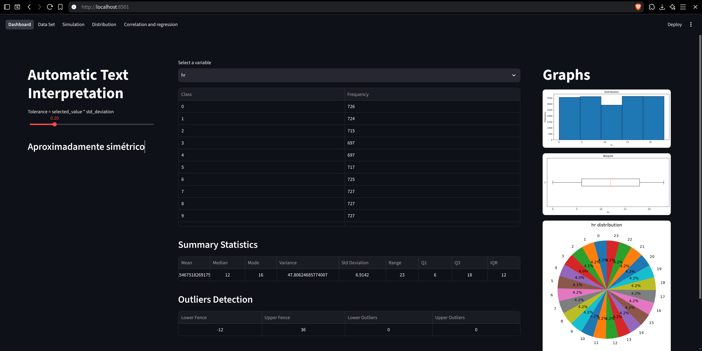
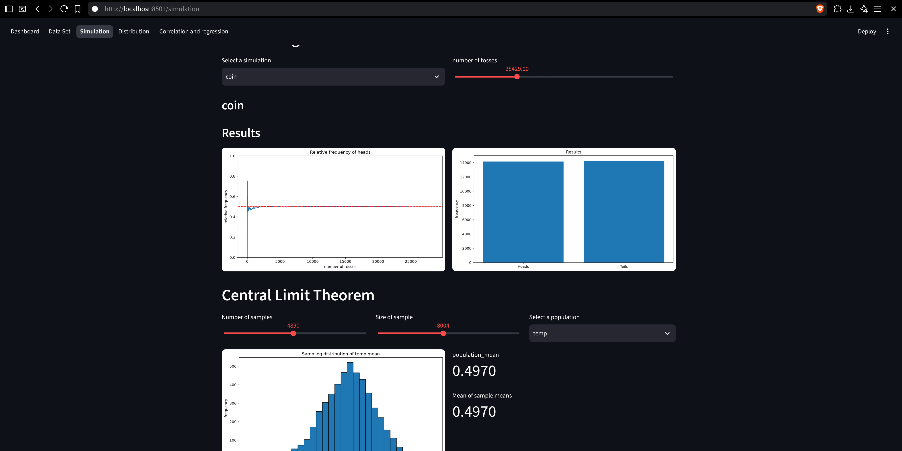
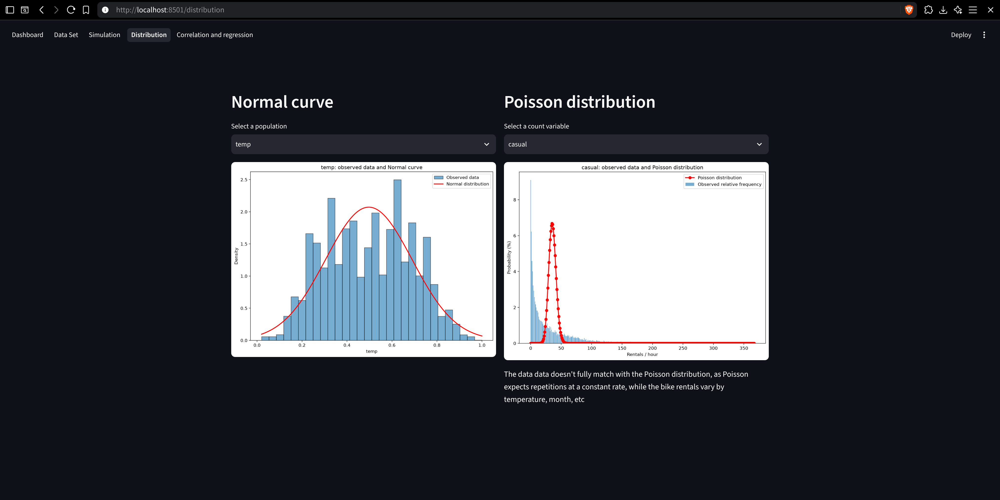

#+title: Readme

* Laboratório de Estatística

** Estudante
Nome: Ian Raphael Sampaio Costa

Matrícula: 72650187

** Descrição

Um laboratório de estatística interativo, onde todas as funções matemáticas foram implementadas do zero e usadas para interagir com um data set real, além de serem testadas automáticamente contra as funções equivalentes disponíveis na biblioteca NumPy através do test_mystats.py

** Data set

O data set escolhido, nomeado "UCI Bike Sharing Dataset", se trata da contagem por hora de alugueis de bike entre 2011 e 2012, feitas através do "Capital Bikeshare System" em Washington nos Estados Unidos. Além disso o data set agrega informações meteorológicas e sazonais correspondendo ao momento em que cada aluguel ocorreu.

O data set está disponível em: https://archive.ics.uci.edu/dataset/275/bike+sharing+dataset

E não foi incluido no repositório do projeto, portanto deve ser baixado separadamente. As instruções para baixá-lo estão incluidas nas intruções de execução abaixo

** Instruções de execução

Existem duas instruções de execução, é recomedado o uso da primeira para garantir que o ambiente seja perfeitamente reproduzido. Siga a segunda instrução somente, e somente se, não possuir o Nix Flakes.

*** Usando Nix Flakes

**** Clone o repositório
Para executar o projeto com Nix Flakes comece clonando o repositório no local desejado:

#+BEGIN_SRC shell
git clone https://github.com/ianrscosta/laboratorio-estatistica
#+END_SRC

**** Baixe o dataset localmente:

Baixe o arquivo bike+sharing+dataset.zip pela interface web ou diretamente pelo link: https://archive.ics.uci.edu/static/public/275/bike+sharing+dataset.zip

Extraia os arquivos para dentro de uma pasta nomeada: data

Coloque esta pasta "data" dentro da pasta "laboratorio-estatistica", pasta principal do projeto

**** Rode nix develop

Entre no diretório do projeto:

#+BEGIN_SRC shell
cd laboratorio-estatistica
#+END_SRC

Ative o ambiente de desenvolvimento com o Nix Flakes:

#+BEGIN_SRC shell
nix develop
#+END_SRC

**** Inicie a interface web

Inicie a interface web Streamlit com Streamlit:

#+BEGIN_SRC shell
python -m streamlit run ./app/streamlit.py
#+END_SRC

*** Sem Nix Flakes

**** Clone o repositório

Para executar o projeto com Nix Flakes comece clonando o repositório no local desejado:

#+BEGIN_SRC shell
git clone https://github.com/ianrscosta/laboratorio-estatistica
#+END_SRC

**** Baixe o dataset localmente:

Baixe o arquivo bike+sharing+dataset.zip pela interface web ou diretamente pelo link: https://archive.ics.uci.edu/static/public/275/bike+sharing+dataset.zip

Extraia os arquivos para dentro de uma pasta nomeada: data

Coloque esta pasta "data" dentro da pasta "laboratorio-estatistica", pasta principal do projeto

**** Crie o virtual environment e instale as dependência

Entre no diretório do projeto:

#+BEGIN_SRC shell
cd laboratorio-estatistica
#+END_SRC

Crie e ative o virtual environment:

#+BEGIN_SRC shell
python3 -m venv .venv
source .venv/bin/activate
#+END_SRC

Atualize o pip e instale as dependências:

#+BEGIN_SRC shell
python -m pip install --upgrade pip
python -m pip install -r ./requirements.txt
#+END_SRC

**** Inicie a interface web

Inicie a interface web Streamlit com Streamlit:

#+BEGIN_SRC shell
python -m streamlit run ./app/streamlit.py
#+END_SRC

** Aplicação em funcionamento

