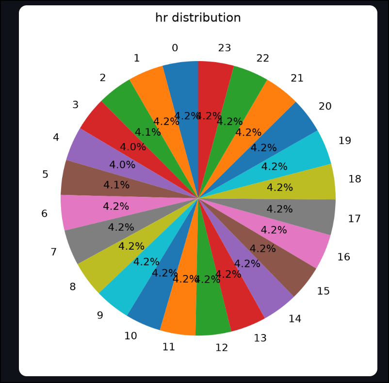

#+title: Relatorio

* Data set

Inicialmente minha ideia era utilizar um data set do preço de ações no S&P500 americano, porém pela falta de dados categóricos, e por não ter tido muito tempo para escolher, acabei utilizando o auxilío de uma IA para chegar no data set de alugueis de bicicleta que usei e que me permitiu cumprir com todos os requisitos do trabalho.

* Decisões de implementação

Para implementar as funções estatíscas na minha biblioteca própria, não tomei nenhuma decisão mirabolante, e só implementei as fórmulas matemáticas básicas. Porém uma decisão interessante que tomei, foi na implementação da função moda, onde ao invés de contar quantas vezes cada elemento aparece e só no final comparar as contagens para ver qual elemento apareceu mais vezes, o que eu fiz foi incialmente ordenar o array de entrada, e sequencialmente ir somando todos os elementos iguais, quando o elemento se tornava diferente, eu guardava a soma do elemento anterior, e caso a soma do elemento atual ultrapassasse a soma do elemento anterior o elemento/soma atuais eram então guardados na memória, e caso isso não acontecesse o elemento/soma anterior continuava na memória. Assim não foi necessário desperdiçar memória armazenando todos os elementos e suas respectivas contagens, além de não ser necessária uma operação extra comparando as contagens no final. Apesar de eu não saber se essa é a melhor implementação principalmente por conta de necessitar passar por um condicional a cada soma, foi uma ideia interessante que tive na hora e consegui implementar.

* Resultado das validações

O teste automatizado pode ser rodado com:

#+BEGIN_SRC shell
python -m pytest -q
#+END_SRC

Foi a primeira vez na vida que escrevi testes automatizados, então não acho que fiz da melhor forma, principalmente porque todos os testes acabaram dentro de um só teste, o que complicaria saber qual função falhou caso houvesse uma falha. Porém como esperado nenhuma das funções testadas falhou.

Os testes foram feitos comparando os resultados das funções da minha própria biblioteca com as funções da biblioteca NumPy utilizando como entrada valores aleatórios gerados pela função random() também da biblioteca NumPy.

* Explicação de cada módulo

As explicações de cada módulo individual estão presentes no vídeo anexado no PDF final, e também logo a baixo:
https://drive.google.com/file/d/11yxBZRZqWPRxQtXLD_KXLtNAbYw0uYvj/view?usp=sharing

* 3 Descubertas do módulo 6

** Primeira

A primeira descoberta que o trabalho me proporcionou foi a a descoberta do fato de que o aluguel de biciletas, pelo menos na região onde os dados foram coletados, se distribui de forma uniforme em todas as 24 horas do dia. Ou seja, mesmo durante a madrugada o aluguel de bicicletas por hora é praticamente o mesmo do que durante as horas do dia. E isso ficou claro principalmente a partir do gráfico pizza implementado para dados categóricos como esse.

** Segunda

Outra descoberta que tive, foi quando estava implementando a comparação da distribuição dos dados do dataset contra a curva de Poisson, porque por mais que os dados escolhidos para fazer essa comparação também fossem sequenciais em relação ao tempo, não imaginei que a diferença entre as duas curvas seria tão grande apenas por conta da quantidade dos alugueis de bicicletas variarem dependendo da situação.

** Terceira

Por último outra coisa que não imaginava eu visualizei no módulo de correlação e regressão, onde quando vendo a correlação dos usuários casuais versos usuários registrados, descobri que na verdade a maior quantidade de alugueis vem de usuários registrados e não de usuários casuais. Inicialmente eu acreditava que fosse o contrário, porém após visualizar isso acaba fazendo sentido porque os mesmos usuários registrados devem alugar as bicicletas repetidas vezes, enquanto a quantidade provávelmente maior de usuários casuais deve alugar somente uma ou poucas vezes.

